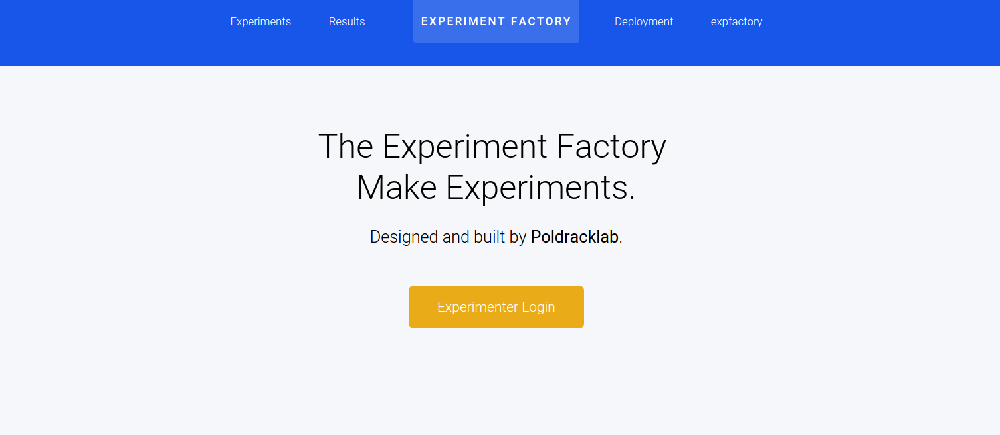

### Docker and The Experiment Factory

   >> Don't forget what happened to the researcher who suddenly got everything he wanted.
   
   >> What happened?
   
   >> He started using Docker.

## Setup for Local Development
Thanks to @NeuroVault for these steps.

### Installing dependencies
1. Fork the [main repository](https://github.com/expfactory/expfactory-docker)
2. Clone your fork to your computer: `git clone https://github.com/<your_username>/expfactory-docker`
  
  >> *Warning: if you are using OS X you have to clone the repository to a subfolder in your home folder - `/Users/<your_username/...` - otherwise boot2docker will not be able to mount code directories and will fail silently.*

3. Install docker >= 1.6 (If you are using OS X you'll also need boot2docker)
4. Install docker-compose >= 1.2
5. If you are using OS X and homebrew steps 3 and 4 can be achieved by: `brew update && brew install docker boot2docker docker-compose`
6. Make sure your docker daemon is running (on OS X: `boot2docker init && boot2docker up`)

### Running the server
To run the server in detached mode, do:

      docker-compose up -d

The webpage will be available at 127.0.0.1 (unless you are using boot2docker - then run `boot2docker ip` to figure out which IP address you need to use). You can also run the server in non-detached mode, which shows all the logs in realtime.

      docker-compose up

### Stopping the server
To stop the server:

      docker-compose stop

### Restarting the server
After making changes to the code you need to restart the server (but just the uwsgi component):

      docker-compose restart nginx uwsgi

### Reseting the server
If you would like to reset the server and clean the database:

      docker-compose stop
      docker-compose rm
      docker-compose up

### Running Django shell
If you want to interactively develop, it can be helpful to do so in the Django shell. Thank goodness we can still connect to it in the floaty Docker container with the following!

      docker-compose run --rm uwsgi python manage.py shell

### Running tests

      docker-compose run --rm uwsgi python manage.py test

### Updating docker image
Any change to the python code needs to update the docker image, which could be adding a new package to requirements.txt. If there is any reason that you would need to modify the Dockerfile or rebuild the image, do:

     docker build -t vanessa/expfactory .

## Local Deployment
Coming soon

## Cloud Deployment

Coming soon

## Getting Started

You should first log in with the super user account, with the following credentials:

      username: expfactory
      password: expfactory

You will be prompted to change this password immediately, to ensure the protection of your database.
